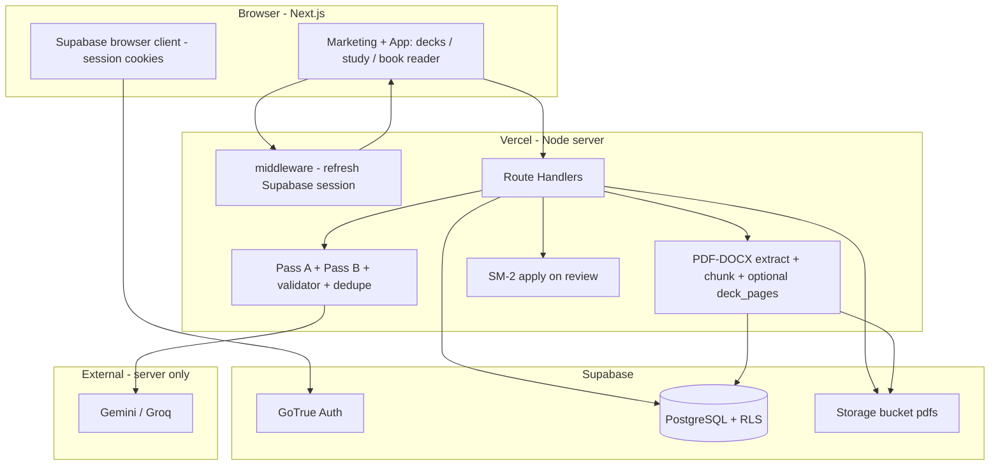
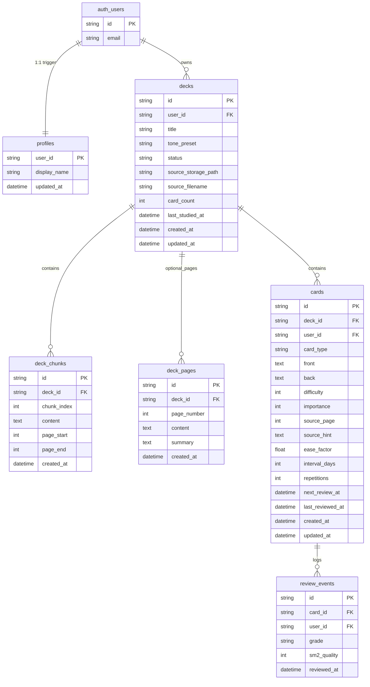

# FlashGenius — Technical architecture (overview)

**Shipped source of truth:** `supabase/migrations/*.sql`, `app/` (routes + UI), `lib/` (generation, PDF/DOCX, SM-2, Supabase helpers), and **`.env.example`**.  
Additional planning or security write-ups may exist locally under `docs/` but are **gitignored** by this repo’s policy—do not assume they exist in every clone.

This file stays **compact** (diagram, schema sketch, API index, env summary). When in doubt, read the migration SQL and the matching `lib/` modules.

---

## 1. Goals (technical)

- Next.js **App Router** (Next 16) on **Vercel**; **Supabase** Postgres + Storage + Auth (`@supabase/ssr` + `middleware.ts` session refresh).
- **Sources:** PDF (and DOCX where supported) → text extract → **chunk** rows (`deck_chunks`); optional per-page rows (`deck_pages`) for book view + on-demand summaries.
- **Card generation:** two-pass LLM pipeline (`lib/generation/passes.ts`, `run-deck-generation.ts`) + **validator** + **dedupe**; invoked from **`POST /api/decks/[deckId]/generate`** (JSON result, `maxDuration` 300s on that route).
- **SRS:** SM-2 fields on `cards`; study queue via `next_review_at` (`lib/sm2.ts`, study API).
- **Secrets:** LLM keys and service role **server-only**; never `NEXT_PUBLIC_*`.

---

## 2. System diagram

---

## 3. Entity–relationship model

**Notes**

- The ER diagram uses **Mermaid-friendly attribute types** (`string`, `datetime`, `int`, …) so GitHub can render it; the database still uses Postgres types (`uuid`, `timestamptz`, `smallint`, …) as defined in migrations.
- `auth.users` is Supabase Auth; `profiles` is created for new users via trigger in `001_initial_schema.sql`.
- `cards.user_id` simplifies RLS (owner-only policies).
- `deck_pages` is in **`003_deck_pages.sql`** (optional until that migration is applied); UI can fall back to chunk-based “pseudo pages”.

---

## 4. PostgreSQL tables (logical schema)

Enums and checks match **`001_initial_schema.sql`** (and **`003_deck_pages.sql`** for pages). Highlights:

### `public.decks`

- **`status`:** `draft` | `uploading` | `extracting` | `generating` | `ready` | `error` (CHECK in DB).
- **`card_count`:** maintained by triggers on `cards` insert/delete.
- **`generation_error`:** user-safe message when `status = error`.

### `public.cards`

- **`user_id`:** NOT NULL, FK to `auth.users`, aligned with RLS.
- **`card_type`:** `definition` | `contrast` | `misconception` | `procedure` | `cloze`.

### `public.deck_pages` (optional migration)

| Column | Notes |
|--------|--------|
| `page_number` | Unique per `deck_id` |
| `content` | Extracted page text (capped at ingest; see env) |
| `summary` | Filled on demand via summarize route |

### `public.review_events`

- **`grade`:** `again` | `hard` | `good` | `easy`; **`sm2_quality`** 0–5.

Full column lists: see migration files.

---

## 5. Storage (Supabase Storage)

| Bucket | Contents |
|--------|----------|
| `pdfs` | Private uploads; path **`{user_id}/{deck_id}/...`**

**RLS (implemented):** insert/select/delete on `storage.objects` for bucket `pdfs` where `(storage.foldername(name))[1] = auth.uid()::text` (see `001_initial_schema.sql`).

---

## 6. Row Level Security (summary)

- **`profiles`:** `user_id = auth.uid()` for all operations.
- **`decks`:** owner-only via `user_id = auth.uid()`.
- **`deck_chunks`**, **`deck_pages`**, **`cards`**, **`review_events`:** access allowed when linked deck is owned by `auth.uid()` (policies use subselect on `decks` or `user_id` on `cards` / `review_events`).

Server routes use the user-scoped Supabase client from the session (`lib/api/route-auth.ts`); service role is optional and documented in `.env.example`.

---

## 7. API surface (Route Handlers)

| Method | Path | Purpose |
|--------|------|---------|
| `GET` | `/api/decks` | Paginated deck list + card aggregates / due counts |
| `POST` | `/api/decks` | Create deck (`title`, optional `tone_preset`) |
| `DELETE` | `/api/decks/[deckId]` | Delete deck, cascade DB rows, remove storage objects under prefix |
| `POST` | `/api/decks/[deckId]/prepare-upload` | Prepare signed / path flow for upload (see implementation) |
| `POST` | `/api/decks/[deckId]/upload` | Accept source file, extract, chunks (+ pages when migration exists) |
| `POST` | `/api/decks/[deckId]/generate` | Run LLM generation (optional `{ "force": true }` to regenerate); rate limit + daily quota checks |
| `PATCH` | `/api/decks/[deckId]/cards/[cardId]` | Edit card fields (validated) |
| `DELETE` | `/api/decks/[deckId]/cards/[cardId]` | Delete card |
| `GET` | `/api/study/queue` | Due + new mix for study session |
| `POST` | `/api/study/review` | `cardId`, `grade` → SM-2 update + `review_events` row |
| `POST` | `/api/decks/[deckId]/pages/[pageNumber]/summarize` | Per-page summary (requires `deck_pages`) |

**Auth:** Supabase session cookies; `middleware.ts` delegates to `lib/supabase/middleware.ts` for session refresh.

---

## 8. SM-2 (implementation)

Implemented in **`lib/sm2.ts`**.

- **Grade → quality `q` (0–5):** Again `0`, Hard `2`, Good `4`, Easy `5`.
- **`applySm2Update`:** classic SM-2 interval + ease factor update; **`next_review_at`** set by API from resulting `interval_days`.

---

## 9. Environment variables

See **`.env.example`**. Server tuning is centralized in:

- **`lib/constants/generation.ts`** — max cards, chunks for LLM, dedupe threshold, batch sizes.
- **`lib/constants/uploads.ts`** — upload size, chunk/page store caps, chunking targets, max chunk rows, max PDF pages stored.
- **`lib/constants/study.ts`** — session / daily new card limits (where applicable).
- **`lib/generation-rate-limit.ts`** — in-memory limiter env vars for generate route.

---

## 10. Key application variables (non-env)

| Name | Purpose |
|------|---------|
| `tone_preset` | Drives prompts / card style (`lib/generation/tone-presets.ts`) |
| `card_type` | Pass B routing / validation (`lib/generation/types.ts`) |
| `DeckStatus` | Lifecycle column on `decks` |
| `Grade` | `again` \| `hard` \| `good` \| `easy` → SM-2 quality |

---

## 11. Security checklist

- No LLM key in client or `NEXT_PUBLIC_*`.
- Service role only where strictly needed; prefer RLS + user client.
- Validate upload type and size server-side (`lib/constants/uploads.ts`, upload routes).
- Rate-limit generation per user (`GENERATE_RATE_LIMIT_*` in `.env.example`).

---

## 12. Deploy / ops notes

- Apply migrations in order (see **`README.md`**): `001_initial_schema.sql` → `002_storage_pdfs_update.sql` → `003_deck_pages.sql` when book view + summaries are required.
- Vercel function body size limits still apply; large PDFs use patterns that avoid posting the whole file through a tiny serverless body cap (see comments in `.env.example`).
- Tune **`maxDuration`** vs chunk count and LLM latency for `/generate`.

---

## 13. Future extensions

- Durable job queue (Redis / worker) for long generations.
- Shared read-only decks, PWA offline study, richer analytics from `review_events`.

---

## 14. Document map (in-repo)

| File | Role |
|------|------|
| `docs/ARCHITECTURE.md` | This overview |
| `README.md` | Setup, migration order, product entry |
| `supabase/migrations/*.sql` | Canonical schema + RLS + storage |
| `.env.example` | Safe env names and defaults documentation |
| `.gitignore` | Excludes local-only docs and secrets |
