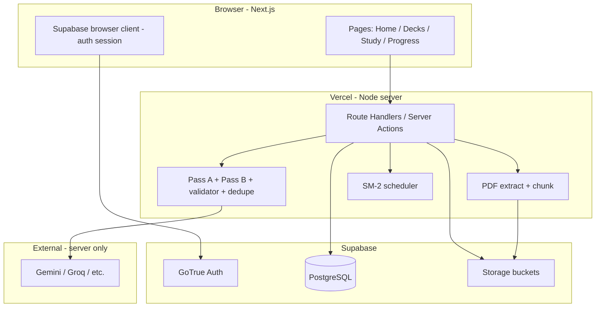

# FlashGenius — Technical architecture (overview)

Complements **`docs/PLAN.md`** (build order and card-quality system). **All resolved decisions, full API shapes, SM-2 code, validator, prompts, day-by-day build, and canonical SQL** are in **[COMPLETE_REFERENCE.md](./COMPLETE_REFERENCE.md)** and **[`../supabase/migrations/001_initial_schema.sql`](../supabase/migrations/001_initial_schema.sql)**.

This file keeps a **compact** diagram, ER sketch, and checklist; treat the complete reference as source of truth where they differ.

---

## 1. Goals (technical)

- Next.js **App Router** on **Vercel**; **Supabase** Postgres + Storage + Auth (recommended single vendor for demo).
- **Card generation:** two-pass LLM pipeline + **validator** + **dedupe**; optional **SSE** streaming from a **Route Handler**.
- **SRS:** SM-2 fields on each card (or normalized sibling table—**TBD**); study queue by `next_review_at`.
- **Secrets:** LLM and service role keys **server-only**; never exposed in client bundles.

---

## 2. System diagram



---

## 3. Entity–relationship model

```mermaid
erDiagram
  auth_users ||--o| profiles : "optional"
  auth_users ||--o{ decks : owns
  decks ||--o{ deck_chunks : contains
  decks ||--o{ cards : contains
  cards ||--o{ review_events : logs

  auth_users {
    uuid id PK
    string email
  }

  profiles {
    uuid user_id PK_FK
    string display_name
    timestamptz updated_at
  }

  decks {
    uuid id PK
    uuid user_id FK
    string title
    string tone_preset
    string status
    string source_storage_path
    string source_filename
    timestamptz last_studied_at
    timestamptz created_at
    timestamptz updated_at
  }

  deck_chunks {
    uuid id PK
    uuid deck_id FK
    int chunk_index
    text content
    int page_start
    int page_end
    timestamptz created_at
  }

  cards {
    uuid id PK
    uuid deck_id FK
    string card_type
    text front
    text back
    smallint difficulty
    smallint importance
    int source_page
    text source_hint
    numeric ease_factor
    int interval_days
    int repetitions
    timestamptz next_review_at
    timestamptz last_reviewed_at
    timestamptz created_at
    timestamptz updated_at
  }

  review_events {
    uuid id PK
    uuid card_id FK
    uuid user_id FK
    string grade
    smallint sm2_quality
    timestamptz reviewed_at
  }
```

**Note:** `auth.users` is managed by Supabase Auth; `profiles` is optional (1:1) for display name / app metadata.

---

## 4. PostgreSQL tables (logical schema)

### 4.1 `public.profiles` (optional)

| Column | Type | Constraints | Notes |
|--------|------|-------------|--------|
| `user_id` | `uuid` | PK, FK → `auth.users(id)` ON DELETE CASCADE | |
| `display_name` | `text` | nullable | |
| `updated_at` | `timestamptz` | default `now()` | |

### 4.2 `public.decks`

| Column | Type | Constraints | Notes |
|--------|------|-------------|--------|
| `id` | `uuid` | PK, default `gen_random_uuid()` | |
| `user_id` | `uuid` | FK → `auth.users(id)` ON DELETE CASCADE, NOT NULL | |
| `title` | `text` | NOT NULL | Default from filename or user input |
| `tone_preset` | `text` | NOT NULL, default `'exam-crisp'` | Check: `exam-crisp` \| `deep-understanding` \| `quick-recall` |
| `status` | `text` | NOT NULL, default `'draft'` | `draft` \| `uploading` \| `extracting` \| `generating` \| `ready` \| `error` (**enum TBD**) |
| `source_storage_path` | `text` | nullable | Bucket object path |
| `source_filename` | `text` | nullable | Original PDF name |
| `generation_error` | `text` | nullable | User-safe message if status = error |
| `last_studied_at` | `timestamptz` | nullable | Updated when study session completes |
| `created_at` | `timestamptz` | default `now()` | |
| `updated_at` | `timestamptz` | default `now()` | |

**Indexes (recommended):** `(user_id, updated_at DESC)`, `(user_id, title)` for search.

### 4.3 `public.deck_chunks` (optional but recommended for two-pass + debugging)

| Column | Type | Constraints | Notes |
|--------|------|-------------|--------|
| `id` | `uuid` | PK | |
| `deck_id` | `uuid` | FK → `decks(id)` ON DELETE CASCADE | |
| `chunk_index` | `int` | NOT NULL | Order within deck |
| `content` | `text` | NOT NULL | Plain text for LLM |
| `page_start` | `int` | nullable | |
| `page_end` | `int` | nullable | |
| `created_at` | `timestamptz` | default `now()` | |

**Index:** `(deck_id, chunk_index)`.

### 4.4 `public.cards`

| Column | Type | Constraints | Notes |
|--------|------|-------------|--------|
| `id` | `uuid` | PK | |
| `deck_id` | `uuid` | FK → `decks(id)` ON DELETE CASCADE, NOT NULL | |
| `card_type` | `text` | NOT NULL | `definition` \| `contrast` \| `misconception` \| `procedure` \| `cloze` |
| `front` | `text` | NOT NULL | |
| `back` | `text` | NOT NULL | |
| `difficulty` | `smallint` | NOT NULL, default `2` | 1–3 |
| `importance` | `smallint` | nullable | 1–3 from Pass A |
| `source_page` | `int` | nullable | |
| `source_hint` | `text` | nullable | Short locator from Pass A |
| `ease_factor` | `numeric` | NOT NULL, default `2.5` | SM-2 |
| `interval_days` | `int` | NOT NULL, default `0` | SM-2 |
| `repetitions` | `int` | NOT NULL, default `0` | SM-2 |
| `next_review_at` | `timestamptz` | nullable | `NULL` = never reviewed (new) |
| `last_reviewed_at` | `timestamptz` | nullable | |
| `created_at` | `timestamptz` | default `now()` | |
| `updated_at` | `timestamptz` | default `now()` | |

**Indexes:** `(deck_id, next_review_at)`, `(deck_id, created_at)` for queue + listing.

### 4.5 `public.review_events` (recommended for progress charts)

| Column | Type | Constraints | Notes |
|--------|------|-------------|--------|
| `id` | `uuid` | PK | |
| `card_id` | `uuid` | FK → `cards(id)` ON DELETE CASCADE | |
| `user_id` | `uuid` | FK → `auth.users(id)` | |
| `grade` | `text` | NOT NULL | UI label: `again` \| `hard` \| `good` \| `easy` |
| `sm2_quality` | `smallint` | NOT NULL | 0–5 after mapping |
| `reviewed_at` | `timestamptz` | default `now()` | |

**Index:** `(user_id, reviewed_at DESC)`, `(card_id, reviewed_at DESC)`.

---

## 5. Storage (Supabase Storage)

| Bucket (suggested) | Contents | Notes |
|--------------------|----------|--------|
| `pdfs` | Original uploads | Private; signed URL or server-only download for extraction |

**RLS:** only owner can read/write objects for their `user_id` path convention, e.g. `{user_id}/{deck_id}/file.pdf`—**exact policy TBD**.

---

## 6. Row Level Security (concept)

- **`decks`:** `user_id = auth.uid()` for SELECT/INSERT/UPDATE/DELETE.  
- **`cards` / `deck_chunks` / `review_events`:** join `decks` where `decks.user_id = auth.uid()` or duplicate `user_id` on child for simpler policies—**TBD**.  
- Server-side generation using **service role** must **not** bypass ownership checks in code (or use locked-down Edge function)—**TBD**.

---

## 7. API surface (REST, Next.js Route Handlers)

| Method | Path | Purpose |
|--------|------|---------|
| `POST` | `/api/decks` | Create deck (`title`, `tone_preset`) |
| `POST` | `/api/decks/[id]/upload` | Multipart PDF → Storage + enqueue extract |
| `POST` | `/api/decks/[id]/extract` | Internal or chained: PDF → chunks rows |
| `POST` | `/api/decks/[id]/generate` | Run Pass A/B; **SSE** optional (`text/event-stream`) |
| `GET` | `/api/decks` | List current user’s decks (+ due counts via aggregate **TBD**) |
| `GET` | `/api/decks/[id]` | Deck metadata |
| `GET` | `/api/decks/[id]/cards` | Paginated cards |
| `PATCH` | `/api/cards/[id]` | Edit `front`, `back`, optional `difficulty` |
| `DELETE` | `/api/cards/[id]` | Delete card |
| `GET` | `/api/study/queue?deckId=&limit=` | Due + new mix |
| `POST` | `/api/study/review` | Body: `cardId`, `grade` → SM-2 update + insert `review_events` |

**Auth:** session cookie or `Authorization: Bearer` from Supabase—**TBD** (middleware).

---

## 8. SM-2 (implementation notes)

- Map UI **Again / Hard / Good / Easy** → SM-2 **quality** `q` in `0..5` (exact table **TBD**; keep monotonic: Again lowest, Easy highest).  
- On each review: recompute `ease_factor`, `interval_days`, `repetitions`, set `next_review_at = now() + interval_days`.  
- **New card:** `repetitions = 0`, `next_review_at` null until first introduction rules—**TBD** (Anki-style “learning” vs simple SM-2 new handling).

Reference: SuperMemo 2 algorithm (canonical descriptions online).

---

## 9. Environment variables

See **`.env.example`** in repo root. Summary:

### 9.1 Supabase (typical)

| Variable | Scope | Required | Notes |
|----------|--------|----------|--------|
| `NEXT_PUBLIC_SUPABASE_URL` | Client + server | Yes | Public by design |
| `NEXT_PUBLIC_SUPABASE_ANON_KEY` | Client + server | Yes | Public; RLS must protect data |
| `SUPABASE_SERVICE_ROLE_KEY` | Server only | Optional | Only if workers need bypass RLS—prefer avoid |

### 9.2 App URL

| Variable | Scope | Required | Notes |
|----------|--------|----------|--------|
| `NEXT_PUBLIC_APP_URL` | Client | Optional | Canonical URL for links/OAuth callbacks |

### 9.3 LLM (choose one primary; others unset)

| Variable | Scope | Required | Notes |
|----------|--------|----------|--------|
| `LLM_PROVIDER` | Server | Recommended | e.g. `gemini` \| `groq` \| `heuristic` |
| `GEMINI_API_KEY` | Server | If Gemini | Google AI Studio |
| `GROQ_API_KEY` | Server | If Groq | |
| `OPENAI_API_KEY` | Server | If OpenAI | Not default for $0 path |

### 9.4 Auth (if using NextAuth in addition to Supabase — **TBD**)

| Variable | Scope | Notes |
|----------|--------|--------|
| `NEXTAUTH_URL` | Server | |
| `NEXTAUTH_SECRET` | Server | |
| Provider secrets | Server | e.g. `GITHUB_ID` — only if used |

### 9.5 Runtime tuning (optional env overrides)

| Variable | Example | Notes |
|----------|---------|--------|
| `MAX_UPLOAD_MB` | `20` | |
| `MAX_CHUNKS_PER_DECK` | `12` | |
| `MAX_CARDS_PER_DECK` | `80` | |
| `CHUNK_CHAR_TARGET` | `3200` | ~800 tokens rough |
| `CHUNK_OVERLAP_CHARS` | `400` | |
| `GENERATION_CHUNK_BUDGET_MS` | `4000` | Per chunk |
| `DEDUPE_SIMILARITY_THRESHOLD` | `0.82` | |

If unset, app uses code defaults (documented in one `config/constants.ts` **TBD**).

---

## 10. Key application variables (non-env)

| Name | Purpose | Determined |
|------|---------|--------------|
| `tone_preset` | Deck setting driving prompts + max back words | Yes — 3 values in PLAN |
| `card_type` | Pass B prompt routing | Yes — 5 enums |
| `DeckStatus` | Upload/generation lifecycle | Partial — extend as needed |
| `Grade` | UI → SM-2 mapping | TBD per implementation |
| `SessionLimits` | New cards per day / queue size | TBD |

---

## 11. Security checklist

- No LLM key in client or `NEXT_PUBLIC_*`.  
- Service role key only on server; never in GitHub.  
- Validate upload MIME (`application/pdf`) and size.  
- Rate-limit `/api/decks/*/generate` per user/IP **TBD**.

---

## 12. Decisions (resolved vs verify at ship time)

**Resolved** (see `docs/COMPLETE_REFERENCE.md`): Supabase Auth (magic link + Google), no NextAuth; SM-2 on `cards`; `user_id` on `cards` for RLS; `deck_chunks` in v1; Gemini primary + Groq fallback + `LLM_PROVIDER`; Pass B batched 3–5; JSON repair pipeline; validator soft question rule for definition/cloze; daily new + session caps via env; SQL migrations without ORM.

**Still verify when you deploy**

- [ ] Current Gemini / Groq **free-tier limits** in your region.  
- [ ] Vercel **function `maxDuration`** on the streaming generate route vs `MAX_CHUNKS_PER_DECK`.  
- [ ] Supabase **Storage** `foldername` helper availability for your project version (or replace with `split_part(name, '/', 1)` if needed).

---

## 13. Future extensions

- Redis + BullMQ for durable queues.  
- Shared read-only decks.  
- PWA offline study.  
- Leitner visualization derived from SM-2 state.

---

## 14. Document map

| File | Role |
|------|------|
| `docs/COMPLETE_REFERENCE.md` | Full spec (APIs, SM-2, prompts, constants, build/deploy) |
| `docs/SECURITY.md` | Security regulations and checklist |
| `docs/PHASES.md` | Phased tasks + security per phase |
| `docs/PLAN.md` | Card quality + narrative plan |
| `docs/ARCHITECTURE.md` | This file — compact ER / overview |
| `supabase/migrations/001_initial_schema.sql` | Canonical SQL |
| `.gitignore` | Secret / local paths excluded from Git |
| `.env.example` | Safe placeholder list |
